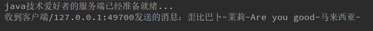
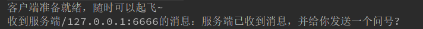
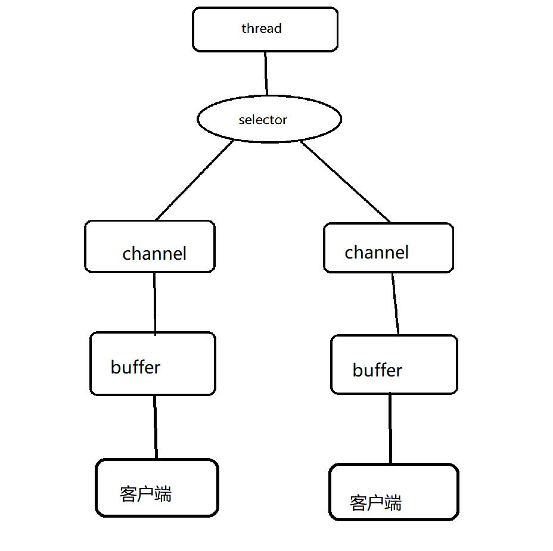
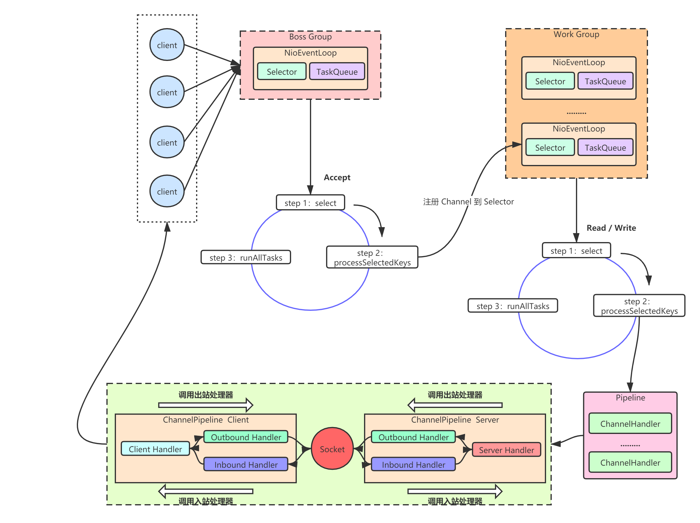
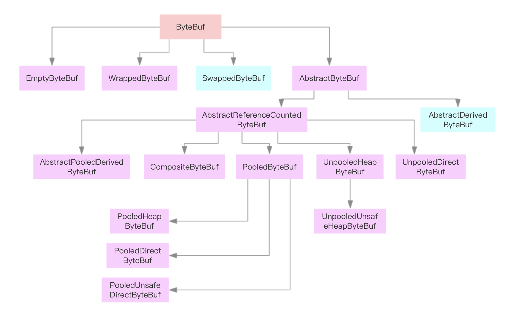
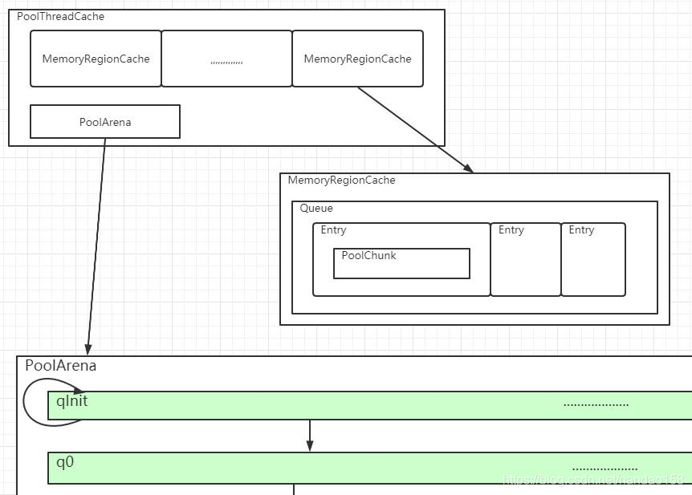
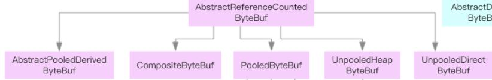
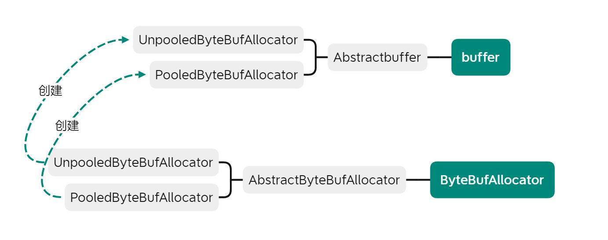
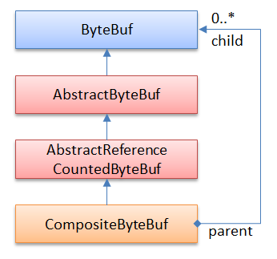

# 一、什么是NETTY
Netty是一个异步事件驱动的网络应用程序框架，用于快速开发可维护的高性能协议服务器和客户端。

# 服务器-客户模型初探
因为我们还没有学习网络相关内容，所以我首先简单了解了一下服务器的原理</p>
1、首先一个服务器会调用java的serversocket类创建一个服务器端套接字，然后监听一个端口</p>
2、很多客户端请求该端口</p>
3、服务器端调用accept方法获取一个来自客户端的socket连接对象</p>
4、启动新线程处理该对象</p>
5、回到第3步</p>

# NIO
原本的服务器模型针对连接事件的accept，针对请求消息的read，写回消息的write都是阻塞的。而NIO提供了非阻塞的处理办法，就是采用事件机制，这样可以让没有请求的时候硬件资源不至于空转，提高了资源利用率。

# 为什么是netty
## 1.封装性好
直观来看如果需要一个建立一个netty服务器,其需要的代码量相对小。
## 2.并发高
因为netty采用了NIO的结构，一个线程能够处理更多请求。
## 3.传输快

# netty能做什么
```java
//创建服务端启动类
public class MyServer {
    public static void main(String[] args) throws Exception {
        //创建两个线程组 boosGroup、workerGroup
        EventLoopGroup bossGroup = new NioEventLoopGroup();
        EventLoopGroup workerGroup = new NioEventLoopGroup();
        try {
            //创建服务端的启动对象，设置参数
            ServerBootstrap bootstrap = new ServerBootstrap();
            //设置两个线程组boosGroup和workerGroup
            bootstrap.group(bossGroup, workerGroup)
                //设置服务端通道实现类型    
                .channel(NioServerSocketChannel.class)
                //设置线程队列得到连接个数    
                .option(ChannelOption.SO_BACKLOG, 128)
                //设置保持活动连接状态    
                .childOption(ChannelOption.SO_KEEPALIVE, true)
                //使用匿名内部类的形式初始化通道对象    
                .childHandler(new ChannelInitializer<SocketChannel>() {
                        @Override
                        protected void initChannel(SocketChannel socketChannel) throws Exception {
                            //给pipeline管道设置处理器
                            socketChannel.pipeline().addLast(new MyServerHandler());
                        }
                    });//给workerGroup的EventLoop对应的管道设置处理器
            System.out.println("java技术爱好者的服务端已经准备就绪...");
            //绑定端口号，启动服务端
            ChannelFuture channelFuture = bootstrap.bind(6666).sync();
            //对关闭通道进行监听
            channelFuture.channel().closeFuture().sync();
        } finally {
            bossGroup.shutdownGracefully();
            workerGroup.shutdownGracefully();
        }
    }
}

//创建服务端处理器
public class MyServerHandler extends ChannelInboundHandlerAdapter {

    @Override
    public void channelRead(ChannelHandlerContext ctx, Object msg) throws Exception {
        //获取客户端发送过来的消息
        ByteBuf byteBuf = (ByteBuf) msg;
        System.out.println("收到客户端" + ctx.channel().remoteAddress() + "发送的消息：" + byteBuf.toString(CharsetUtil.UTF_8));
    }

    @Override
    public void channelReadComplete(ChannelHandlerContext ctx) throws Exception {
        //发送消息给客户端
        ctx.writeAndFlush(Unpooled.copiedBuffer("服务端已收到消息", CharsetUtil.UTF_8));
    }

    @Override
    public void exceptionCaught(ChannelHandlerContext ctx, Throwable cause) throws Exception {
        //发生异常，关闭通道
        ctx.close();
    }
}

//创建客户端启动类
public class MyClient {

    public static void main(String[] args) throws Exception {
        NioEventLoopGroup eventExecutors = new NioEventLoopGroup();
        try {
            //创建bootstrap对象，配置参数
            Bootstrap bootstrap = new Bootstrap();
            //设置线程组
            bootstrap.group(eventExecutors)
                //设置客户端的通道实现类型    
                .channel(NioSocketChannel.class)
                //使用匿名内部类初始化通道
                .handler(new ChannelInitializer<SocketChannel>() {
                        @Override
                        protected void initChannel(SocketChannel ch) throws Exception {
                            //添加客户端通道的处理器
                            ch.pipeline().addLast(new MyClientHandler());
                        }
                    });
            System.out.println("客户端准备就绪");
            //连接服务端
            ChannelFuture channelFuture = bootstrap.connect("127.0.0.1", 6666).sync();
            //对通道关闭进行监听
            channelFuture.channel().closeFuture().sync();
        } finally {
            //关闭线程组
            eventExecutors.shutdownGracefully();
        }
    }
}
//创建客户端处理器
public class MyClientHandler extends ChannelInboundHandlerAdapter {

    @Override
    public void channelActive(ChannelHandlerContext ctx) throws Exception {
        //发送消息到服务端
        ctx.writeAndFlush(Unpooled.copiedBuffer("12345678", CharsetUtil.UTF_8));
    }

    @Override
    public void channelRead(ChannelHandlerContext ctx, Object msg) throws Exception {
        //接收服务端发送过来的消息
        ByteBuf byteBuf = (ByteBuf) msg;
        System.out.println("收到服务端" + ctx.channel().remoteAddress() + "的消息：" + byteBuf.toString(CharsetUtil.UTF_8));
    }
}
```
MyServer打印结果:

MyClient打印结果：


# netty包含的三大组件
* ByteBuf：所有客户端传来的消息，都要经过buffer才能传给线程做处理。
* channel：可以读写buffer并传给线程的组件。
* selector：由于采用事件机制，一个selector上可以注册多个客户端，通过selector来不断轮询所有channel，只有当有事件发生时才会传给线程去执行。
netty简单的结构图：


netty工作的顺序图：


# 我挑选的模块：ByteBuf
## 基本功能
ByteBuf是Netty框架封装的数据缓冲区，区别于java本身定义的ByteBuffer需要有position、limit、flip等属性和操作来控制byteBuffer数据读写，Bytebuf通过两个位置指针来协助缓冲区的读写操作，分别是readIndex和writerIndex。
初始化ByteBuf时，readIndex和writerIndex取值一开始是0，随着数据的写入writerIndex会增加，读取数据会使readIndex增加，但不会超过writerIndex。在读取之后0-readIndex被视为discard，调用discardReadBytes方法，释放这部分空间，然后readIndex就被清零，writerIndex被清为之前的writerIndex-readIndex。

使用实例：
```java
public static void main(String[] args) {
    //分配大小为10的内存
    ByteBuf buf = Unpooled.buffer(10);
    //写入
    buf.writeBytes("csc".getBytes());
    //读取
    byte[] b =  new byte[3];
    buf.readBytes(b);
    System.out.println(new String(b));
    System.out.println(buf.writerIndex());
    System.out.println(buf.readerIndex());
}
结果：
csc
3
3
```
## ByteBuf所包含的类：


## ByteBuf的API：
```java
//获取ByteBuf分配器
public abstract ByteBufAllocator alloc()
//丢弃可读字节
public abstract ByteBuf discardReadBytes()
//返回读指针
public abstract int readerIndex()
//设置读指针
public abstract ByteBuf readerIndex(int readerIndex);
//标志当前读指针位置，配合resetReaderIndex使用
public abstract ByteBuf markReaderIndex()
public abstract ByteBuf resetReaderIndex()
//返回可读字节数
public abstract int readableBytes()
//返回写指针
public abstract int writerIndex()
//设置写指针
public abstract ByteBuf writerIndex(int writerIndex);
//标志当前写指针位置，配合resetWriterIndex使用
public abstract ByteBuf markWriterIndex()
public abstract ByteBuf resetWriterIndex()
//返回可写字节数
public abstract int writableBytes()
public abstract ByteBuf clear();
//设置读写指针
public abstract ByteBuf setIndex(int readerIndex, int writerIndex)
//指针跳过length
public abstract ByteBuf skipBytes(int length)
//以当前位置切分ByteBuf todo
public abstract ByteBuf slice();
//切割起始位置为index，长度为length的ByteBuf todo
public abstract ByteBuf slice(int index, int length);
//Returns a copy of this buffer's readable bytes. //复制ByteBuf todo
public abstract ByteBuf copy()
//是否可读
public abstract boolean isReadable()
//是否可写
public abstract boolean isWritable()
//字节编码顺序
public abstract ByteOrder order()
//是否在直接内存申请的ByteBuf
public abstract boolean isDirect()
//转为jdk.NIO的ByteBuffer类
public abstract ByteBuffer nioBuffer()
```

## ByteBuf实现方式
ByteBuf是一个抽象类，内部全部是抽象的函数接口，AbstractByteBuf这个抽象类基本实现了ByteBuf，下面我们通过分析AbstractByteBuf里面的实现来分析ByteBuf的工作原理。

ByteBuf都是基于字节序列的，类似于一个字节数组。在AbstractByteBuf里面定义了下面5个变量：

//源码
int readerIndex; //读索引
int writerIndex; //写索引
private int markedReaderIndex;//标记读索引
private int markedWriterIndex;//标记写索引
private int maxCapacity;//缓冲区的最大容量
ByteBuf 与JDK中的 ByteBuffer 的最大区别之一就是： 
（1）netty的ByteBuf采用了读/写索引分离，一个初始化的ByteBuf的readerIndex和writerIndex都处于0位置。 
（2）当读索引和写索引处于同一位置时，如果我们继续读取，就会抛出异常IndexOutOfBoundsException。 
（3）对于ByteBuf的任何读写操作都会分别单独的维护读索引和写索引。maxCapacity最大容量默认的限制就是Integer.MAX_VALUE。

# 二、核心设计流程分析
在这一部分中，我们具体分析ByteBuf所涉及到的所有类和它们的类间关系。

## 1.类间关系
* ByteBuf是入口类，它提供了大量的静态方法，如capacity，alloc，order等等，是入口类。
* AbstractByteBuf主要定义了一些所有buf都具有的属性，比如readIndex，writeindex，标记位置等等，但是这里AbstractByteBuf抽象类并没有定义具体缓冲区的实现，其具体实现由子类进行定义。这里从ByteBuf到AbstractByteBuf，从AbstractByteBuf到其子类都是使用的继承，并不符合**合成/聚合复用原则**，我认为主要原因是前两个抽象类定义的都是一些共有的属性，并不适合按照合成/聚合复用原则将其封装在一个模块里，所以使用了继承。</p>
`合成/聚合复用原则:尽量使用组合/聚合达到复用而非继承。`
* 依赖于AbstractByteBuf的子类之一是PooledByteBuf，它使用带有内存池管理的机制来处理缓冲区，其性能比普通ByteBuf高了几十倍。而PooledByteBuf又有三个子类PooledHeapByteBuf、PooledDirectByteBuf、PooledUnsafeDirectByteBuf。这三个子类分别是使用堆内存的字节数组和直接缓存实现的PooledByteBuf。这里我认为符合设计原则中的**开闭原则**。虽然目前基本上对ByteBuf的主流的使用都是使用PooledByteBuf，但是这样一步一步继承让netty能够灵活的任何层面上对ByteBuf的实现做出修改而不影响使用netty的代码的正常运行。比如又有了新的数据结构能够更快的支持内存池技术，就只需要增加一个PooledByteBuf的子类，这个子类使用新的数据结构实现内存池，而不需要更改更高级的抽象。如果不想使用内存池技术了，也只需要增加AbstractByteBuf的子类即可。</p>
`开闭原则：面向扩展开放，面向修改关闭。`
* 如果使用PooledByteBufAllocator的默认对象对象去分配一个ByteBuf对象，它会使用PooledHeapByteBuf来进行分配。而分配过程中，非常重要的三个类分别是PoolThreadCache、MemoryRegionCache、PoolArena。其中PoolThreadCache负责管理专属于一个线程的内存，而PoolArena负责管理几个线程共享的内存。而MemoryRegionCache则负责具体记录内存块信息。我认为这里很好的体现了**单一职责原则**。这样的话PoolThreadCache只关注对线程已经拥有的内存块的管理，它不需要关注内存的物理实现。而MemoryRegionCache则负责具体一个内存块的内部实现，不需要关注调度的问题。PoolArena则关注剩余内存的管理，对它来说只需要处理外部请求。</p>
同时，我认为这一部分还体现了**迪米特原则（最少知道原则）**。比如内存的物理地址等信息就只在MemoryRegionCache里被知道。而整个内存的使用情况就只有PoolArena知道，这样就很好的降低了每个部分的复杂度，达到了**解耦**的目的。</p>
`单一职责原则：每一个类应该只做一件事情。`</p>
`迪米特原则（Law of Demeter）又叫最少知道原则（Least Knowledge Principle），可以简单说成：talk only to your immediate friends，只与你直接的朋友们通信，不要跟“陌生人”说话。`

<center>PoolThreadCache、MemoryRegionCache、PoolArena三个类的示意</center>
<center>引用自https://blog.csdn.net/nandao158/article/details/113817602</center>

# 三、高级设计意图分析
## 1、策略模式
>意图：定义一系列的算法,把它们一个个封装起来, 并且使它们可相互替换。
>
>主要解决：在有多种算法相似的情况下，使用 if...else 所带来的复杂和难以维护。
>
>何时使用：一个系统有许多许多类，而区分它们的只是他们直接的行为。
>
>如何解决：将这些算法封装成一个一个的类，任意地替换。
>
>关键代码：实现同一个接口。

在buffer的实现过程中，由于提供给了用户多种buffer的物理实现选择，所以使用到了策略模式。回顾上一部分，我们知道AbstractReferenceCountedByteBuf有五个子类对应不同的物理实现，这就是策略模式的体现。


## 2、工厂模式
>意图：定义一个创建对象的接口，让其子类自己决定实例化哪一个工厂类，工厂模式使其创建过程延迟到子类进行。
>
>主要解决：主要解决接口选择的问题。
>
>何时使用：我们明确地计划不同条件下创建不同实例时。
>
>如何解决：让其子类实现工厂接口，返回的也是一个抽象的产品。
>
>关键代码：创建过程在其子类执行。

在buffer中，创建buffer实例都是由bytebufallocator来创建，此处就使用了抽象工厂模式。在bytebufallocator是一个接口，它没有给出buffer的具体实现。被AbstractByteBufAllocator继承，而具体的实现则在继承自AbstractByteBufAllocator的UnpooledByteBufAllocator和PooledByteBufAllocator当中。这样可以方便用户在使用时自己决定实例化哪种缓冲区。

```java
public interface ByteBufAllocator {
...
    ByteBuf buffer();
...
}

public abstract class AbstractByteBufAllocator implements ByteBufAllocator {
...
}
public final class UnpooledByteBufAllocator extends AbstractByteBufAllocator {
    ...
    public UnpooledByteBufAllocator(boolean preferDirect) {
        this(preferDirect, false);
    }

}

public class PooledByteBufAllocator extends AbstractByteBufAllocator {
    ...

}
```
## 3、组合模式
CompositeByteBuf可以让我们把多个ByteBuf当成一个大Buf来处理，ByteBufAllocator提供了compositeBuffer()工厂方法来创建CompositeByteBuf。CompositeByteBuf的实现使用了组合模式，如下图所示：</p>
</p>
示意图引自https://blog.csdn.net/zxhoo/article/details/17577865


# 四、总结
面向对象的编程思想是适用于多人维护，周期较长的大型项目的。我们现在即使理解了所有面向对象思想和编程方法，也比较难自发的把它们使用到日常的编程过程中。
可能只有真正参与了大型项目，体会到面向对象的方法对于代码鲁棒性，可读性，可用性的提升才能够真正学会变相对象。
